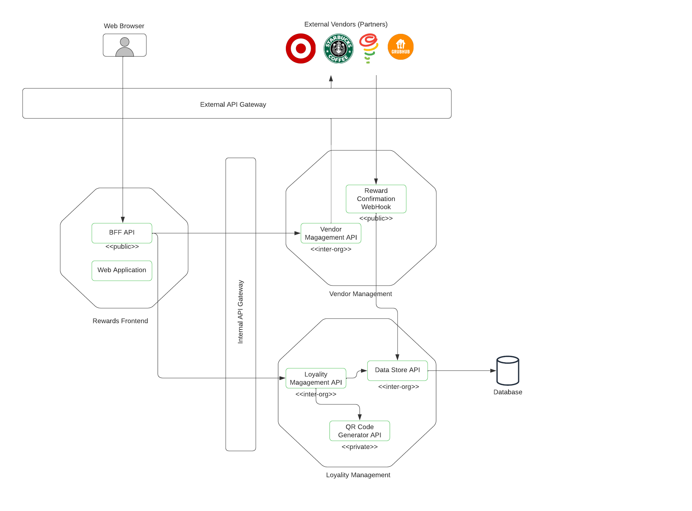

# Customer Reward Management System

## Use case

This sample demonstrates a customer reward management system. The users can login to the web application and redeem rewards. When the user on the website chooses a specific reward deal and agrees to the terms and conditions, we initiate a workflow. This workflow retrieves the user's details from the JWT token. These details are then forwarded to the External Reward Vendor through the Vendor Management API. Upon successful receipt of the information, the Reward Vendor responds with a 200 status. Subsequently, they POST a 16-digit number as a reward confirmation to the Reward Confirmation Webhook. This reward confirmation number is stored in the user's profile, allowing them to available discount via the Loyalty Management API.



## Try out in Choreo

1. Login to [Choreo](https://console.choreo.dev/login).
2. Join the Choreo `Demo Organization` from the organization dropdown list.
3. Select `Customer Reward Management` project.
4. Select `Reward Management Web App` component.
5. Copy the Web App URL and login to the web application.
6. Try out the web application by choosing a specific reward deal.

## Deploy in Choreo

### Prerequisites

- Create a new application using Choreo Developer Portal and generate credentials. Use this application to subscribe the below APIs.

### Steps

To deploy this demo use case in Choreo, follow these steps:

1. Fork this repo.
2. Create a project called `Loyalty Management` to deploy all the loyalty management related components.
    - Create a `Service` component using `Docker` buildpack and link the `loyalty-management/qrcode-generator-api` directory. 
      - Deploy this component with `Project` level network visibility.
    - Create a `Service` component using `Ballerina` buildpack and link the `loyalty-management/data-store` directory. 
      - Deploy this component with `Organization` level network visibility using your DB credentials.
      - Publish this API to Choreo Developer Portal and subscribe to the configured application.
    - Create a `Service` component using `Docker` buildpack and link the `loyalty-management/loyalty-engine` directory.
      - Set the below configurables.
        - DATA_STORE_API_URL = `<project level URL of Data Store API>`
        - QR_CODE_GENERATOR_API_URL = `<project level URL of QR Code Generator API>`
      - Deploy this component with `Organization` level network visibility.
      - Publish this API to Choreo Developer Portal and subscribe to the configured application.
3. Create a project called `External Vendor Management` to deploy all the vendor management related components.
    - Create a `Service` component using `Ballerina` buildpack and link the `vendor-management/reward-confirmation-receiver` directory.
      - Set the below configurables.
        - clientId = `<Cliend ID of the Data Store API subscribed application>`
        - clientSecret = `<Client Secret of the Data Store API subscribed application>`
        - tokenUrl = `<Token URL of the Data Store API subscribed application>`
        - dataSourceApiEndpoint = `<organization level URL of Data Store API>`
      - Deploy this component with `Public` level network visibility.
      - Publish this API to Choreo Developer Portal and subscribe to the configured application.
    - Create a `Service` component using `Docker` buildpack and link the `vendor-management/reward-vendor` directory.
      - Set the below configurables.
        - CLIENT_ID = `<Cliend ID of the Reward Confirmation Webhook subscribed application>`
        - CLIENT_SECRET = `<Client Secret of the Reward Confirmation Webhook subscribed application>`
        - TOKEN_URL = `<Token URL of the Reward Confirmation Webhook subscribed application>`
        - REWARD_CONFIRMATION_WEBHOOK_URL = `<public level URL of Reward Confirmation Webhook>/confirm`
      - Deploy this component with `Organization` level network visibility.
      - Publish this API to Choreo Developer Portal and subscribe to the configured application.
4. Create a project called `Customer Reward Management` to deploy all the customer reward management frontend related components.
    - Create a `Service` component using `Ballerina` buildpack and link the `rewards-frontend/reward-management-api` directory.
      - Set the below configurables.
        - tokenIssuer = `<Token issuer>`
        - jwksEndpoint = `<Jwks endpoint>`
        - clientId = `<Cliend ID of the dependent APIs subscribed application>`
        - clientSecret = `<Client Secret of the dependent APIs subscribed application>`
        - tokenUrl = `<Token URL of the dependent APIs subscribed application>`
        - loyaltyApiUrl = `<organization level URL of Loyalty Management API>`
        - vendorManagementApiUrl = `<organization level URL of Vendor Management API>`
      - Deploy this component with `Public` level network visibility.
      - Publish this API to Choreo Developer Portal and subscribe to the configured application.
    - Create a `Web Application` component using `React` buildpack and link the `rewards-frontend/reward-management-web-app` directory.
      - Set the below configurables.

        ```
            window.config = {
                redirectUrl: "<public level URL of the Web App>",
                asgardeoClientId: "<Cliend ID of the Reward Management API subscribed application>",
                asgardeoBaseUrl: "<Base URL of the Token URL of the Reward Management API subscribed application>",
                apiUrl: "<public level URL of the Reward Management API>",
            }
        ```
      - Deploy this component with `Public` level network visibility and try out the web application.

